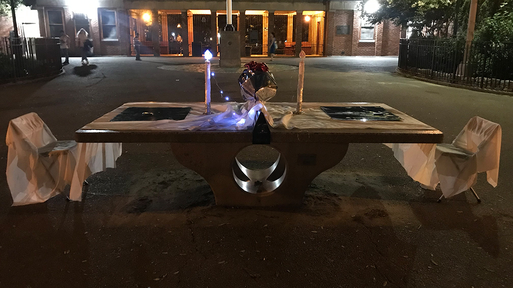
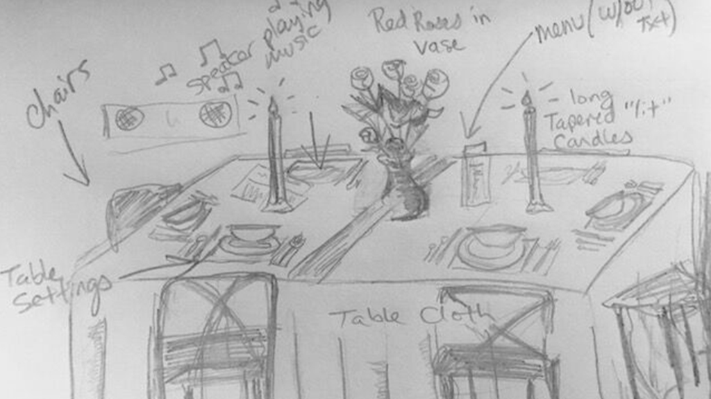

## 2019 Final Project

### [10/26/19 - Prototype 5: Window doodle](blog5_7.md)

### [10/25/19 - Prototype 4: You are what you eat](blog4_7.md)

### [10/24/19 - Prototype 3: Card menu](blog3_7.md)

### [10/23/19 - Prototype 2: Cook for one, cook for fun](blog2_7.md)

### [10/22/19 - Prototype 1: Man in the mirror](blog1_7.md)

### [10/20/19 - Midterm Reflection](blog7.md)

### [10/05/19 - Data Visualization](blog6.md)

### [10/01/19 - Research Observation](blog5.md)

## ------------------------------------------------------------------------

## Instruction Sets for Strangers

### [09/14/19 - Prototype III](blog4.md)

### [09/09/19 - Prototype II](blog3.md)

### [09/03/19 - Prototype I](blog2.md)

### [08/31/19 - Research, Brainstorming and 1st Draft](blog1.md)

