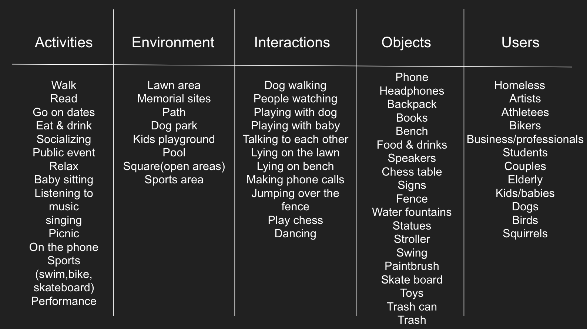
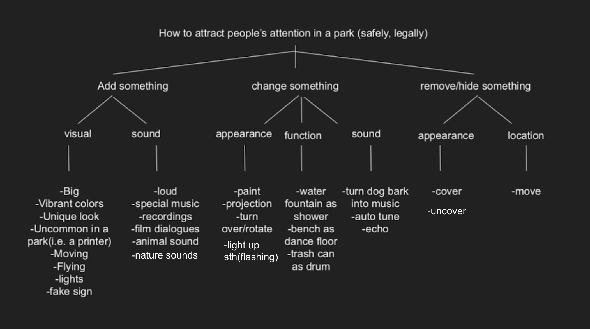
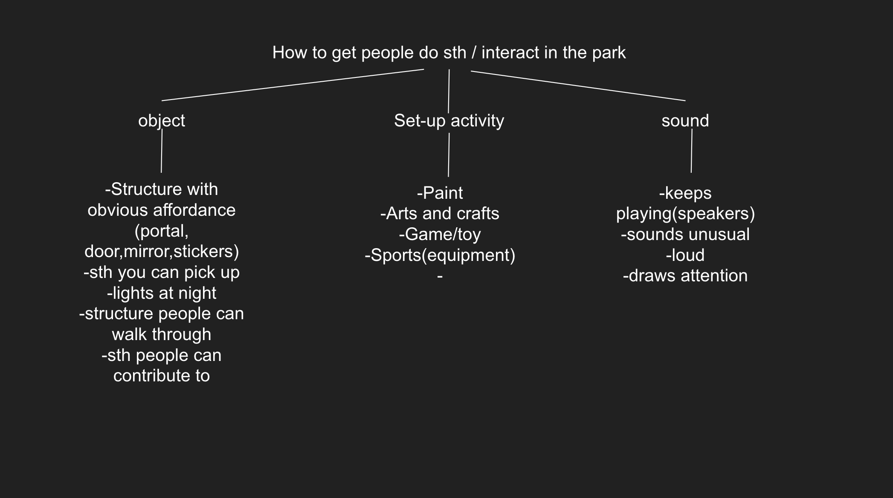
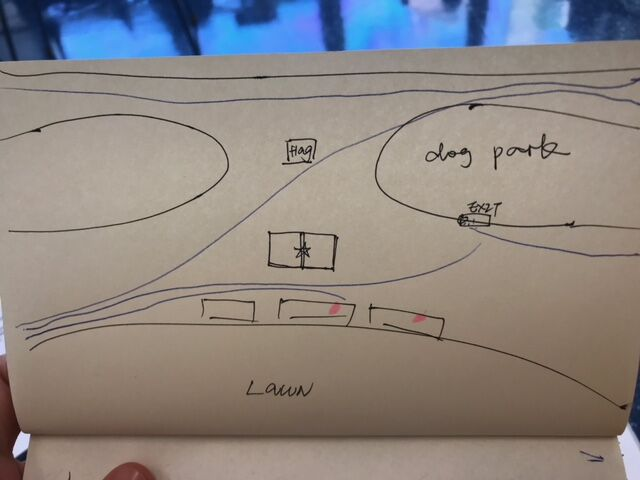

[<Back](README.md)

## 08/31/19 - Research and Brainstorming

### Thompkin Square Park
Since its beginnings in the 19th century, Tompkins Square Park has served as a home for New Yorker’s to voice their political dissent. In 1857 and 1875 residents protested job scarcity and the poor economy. In the 1980’s and 90’s, local residents protested gentrification.

