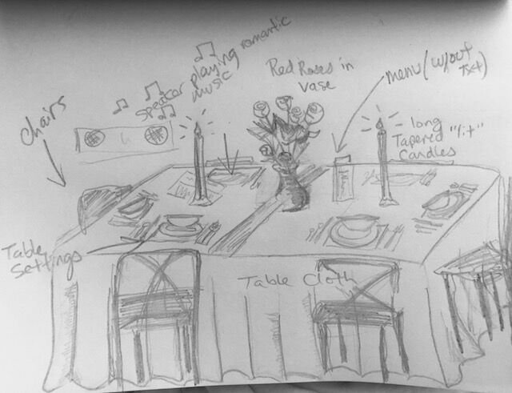

[<Back](README.md)

## 08/31/19 - Research, Brainstorming and 1st Draft

### Location:
Thompkin Square Park
### Background Research:
Since its beginnings in the 19th century, Tompkins Square Park has served as a home for New Yorker’s to voice their political dissent. In 1857 and 1875 residents protested job scarcity and the poor economy. In the 1980’s and 90’s, local residents protested gentrification.

While we were walking around the park, we found some historical memorial sites as well as an honor memorial tree for the late park supervisor. All of these have made it a lovely public space for residents and vitnessed the change of the park along the history.

Temperance Fountain

Slocum Memorial Fountain

Harry Greenberg Memorial Tree

### Design Process 
AEIOU

Brainstroming Tree

During the observation, we saw an "abandoned" pingpong table made of stone. It's nicely buildt and quite spacial but no one was actually using it. Lots of people were walking by because it's well located, but the area is quite cozy and chill since most of them were resting on the bench or walking their dogs. We decided to choose this pingpong table as the spot where the interaction is to happen.

img

We also liked the idea of changing the function of something and there is a lot that we could do to turn the pingpong table into something else.

Behavior Mapping

We mapped the track people walking around the pingpong table and counted how many of each group of people were walking by.

### Ideation
The first idea we came with was to simply provide a pair of paddle and a pingpong ball and let people play. Adding color on the table and even making a luminous ball could also make it eyecatching and attract people here. 

Make the pingpong table function as a pingpong table is a safe choice. But as our brainstorming and ideating going further, we came up of more interesting ideas. How about making it something totally different? There are a few examples came to mind.

*Beyond the Streets, Bill Barminski*

*Dinner Party, Judy Chicago*

As shown in our map, there are a lot of couples, friends and students walking by. Why don't we make a public date table in the park? It could be romantic, but more in a fun and playful way. 

We decided to add chairs around the table, place table cloth, tableware made of cupboard and paper and other items on it to make a fun and beautiful place where people can stop and interact with. It could be romantic but more in a playful way. We'll observe the interactions(sitting down? taking pics? talking?) and document it by shooting a video. 
