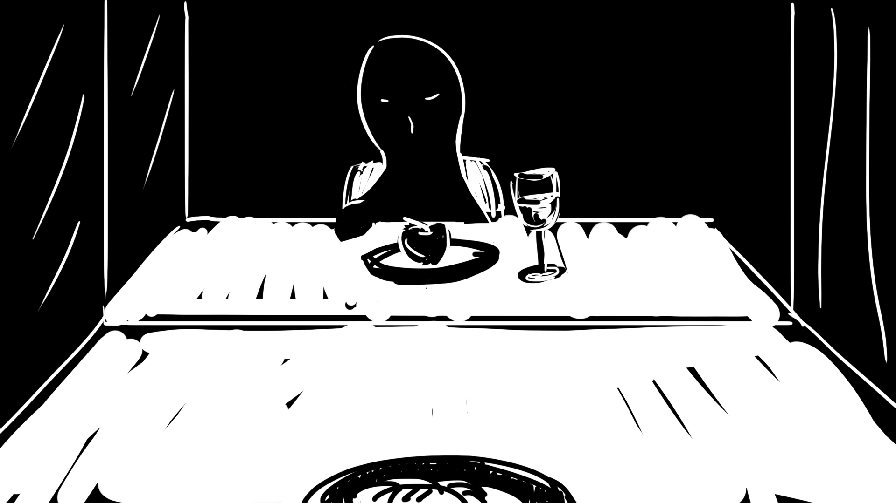

[<Back](README.md)

## 10/22/19 - Prototype 1

[Click here to watch the video](https://drive.google.com/file/d/1FeSDXt9Ow54KEIpBVXwNEJN3e48XYGL3/view?usp=sharing)

The first prototype is an animation about "me" and a mysterious man in the mirror in front of the dining table.
It's inspired by how I(and a lot of others) always look at the screen of phone/computer/TV in front of us while eating. To watch a TV show or a short video, we need something exciting to fill in the quietness and loneliness while eating by ourselves. A mirror could also be considered a big screen. Rather than watching a fastfood TV show and forgetting most of it after a few days, isn't it much better if we could go on an unexpected journey, encounter someone special, and remember it as a valuable experience for the rest of our lives?
