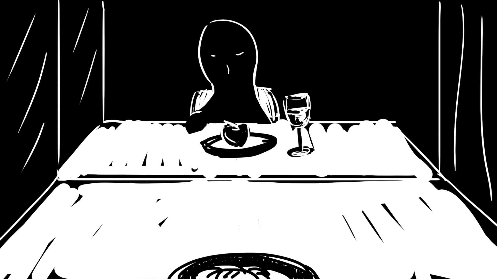

[<Back](README.md)

## 10/23/19 - Prototype 2: Cook for one, cook for fun

[Click here to watch the video](https://drive.google.com/file/d/14CyMyFGTxwIy83NpYxRZkmr4R7eirwZC/view?usp=sharing)

Prototype 2 is a funny "cooking" video. I used paper, plastic balls and paper clips as "ingredients" to cook a playful meal. As the title says, cooking for one could also be a fun thing to do and to enjoy. The theme color of this video, yellow, is a fun, bold and delightful color. The chef and eater(me) in the video turned yellow(lip color, earrings, T-shirt...) after eating the yellow meal. This could be seen as a methphor to say how eating can enlight, empower and cheer one up when you embrace and enjoy the fun and possibilities of eating alone.
