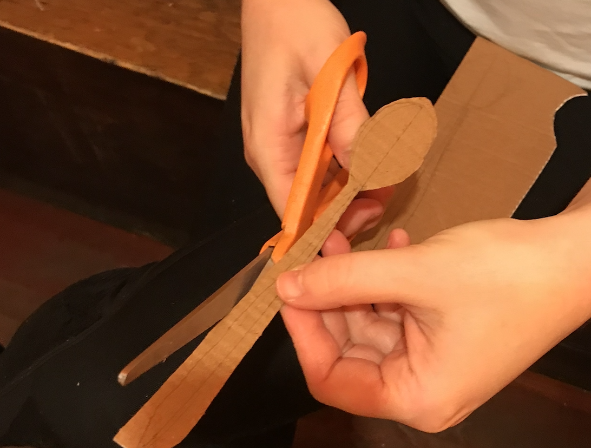
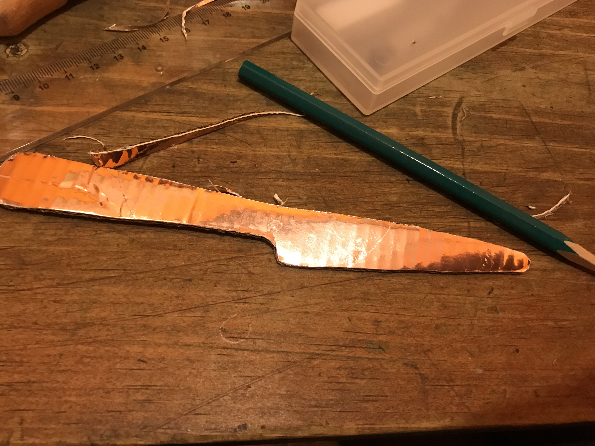
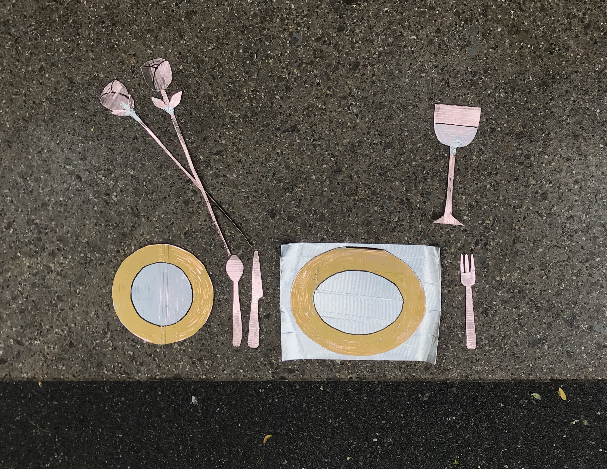
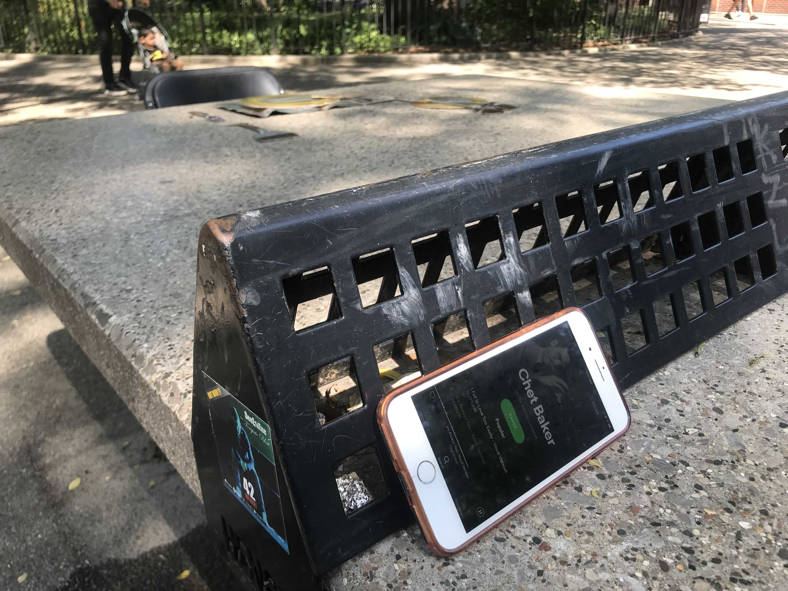
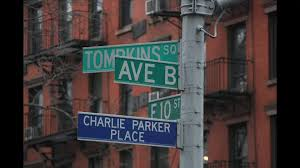
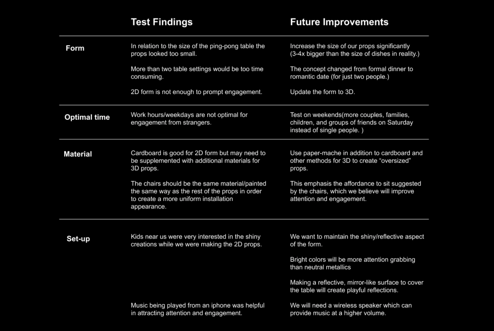
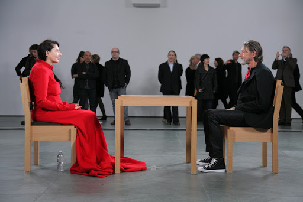

[<Back](README.md)

## 09/10/19 - Prototype I & II
### Prototype I
After the research and ideation, we settled on changing the function of the existing form, by using the ping-pong table in an absurd way and setting it as if in preparation for a formal dinner. We were attracted to the idea of an interactive installation which speaks to surrealism and absurdity. We imagine strangers engaging with the form by sitting at the table and taking pictures with the installation and props, and interacting with other users. 
#### Concept
The dining table set for two explores communication and the relationship between two people seated at either end of the table. By interacting with one another through their engagement with the installation, we are creating a formal dining spread like one would experience on a romantic date in an absurd, cartoon-like, altered reality where items are larger than life, brightly colored, and reflective.
#### Making Process
After a rough sketch from last round of discussion, we made a few 2D models out of cardboard for prototype I.

We made plates, placemats, sliverwares, wine glasses and roses for each side as symbols to make a dinner date. We also painted them with shinny paint to creative an eye-catching reflective surface.

#### Prototype Model
After reading *What Do Prototypes Prototype*, we thought our prototype touched all three kinds of prototypes: role, look and feel, and implementation. So we put it in the center and defined it as an integrated prototype.

#### Questions
The questions we set out to answer during our first prototype were: 

-Are we using the right materials (cardboard)? 

-Will the setup prompt attention and engagement if we include chairs (an affordance to sit) at the “dining table”? 

-What is the optimal day of the week and time of day for stranger interaction?  

#### Planned Interaction
-Strangers will notice, stop, and sit in the chairs.

-Play with and engage with the installation.

-Take pictures of one another.

-Talk to each other.

#### On-Site Test
We did our first prototype in Tompkins Square Park from 11am to 12pm on Tuesday Sep 3.

We borrowed chairs from the church nearby and set up the table with the cardboard models we made.

We also put an iPhone on the divider to play jazz to create a romantic date-like ambiance, which also touched the history of famous jazz musician Charlie Parker who lived just off to the park.

The test went on for about 40 minutes. Here's the link to our documentation video:
https://drive.google.com/open?id=1_HcqHmJrMhzm2GlPKin2euVE_hietx5c
 

#### Test Findings

#### Conclusion
-The metallic, shiny, neutral colored 2D props invited curiosity and attention. 

-The installation did not appear as enough of an eye-catching spectacle to generate very much engagement.

-We saw a higher attention rate after we started playing music (jazz for a date-like ambiance) from an iphone on the table. 

-The chairs set up at either end of the dining table sparked attention from people walking by, and brought people’s eyes to the table setting. 

In summary, we found that 2D cardboard props were too hard for people to distinguish and that as a whole, the installation did not appear as enough of an eye-catching spectacle to generate very much engagement. 
The jazz playing from the iphone significantly increased attention and drew more engagement with the table. 

#### Future Inspiration
After doing our prototype 1, we were reminded of the performance art piece by Marina Abramovic called “Sitting with Marina” at the Museum of Modern Art in 2010. In the show the artist sat motionless for seven hours at a time, and looked into the eyes of museum visitors sitting across from her at a table until they felt some kind of connection or reaction.

