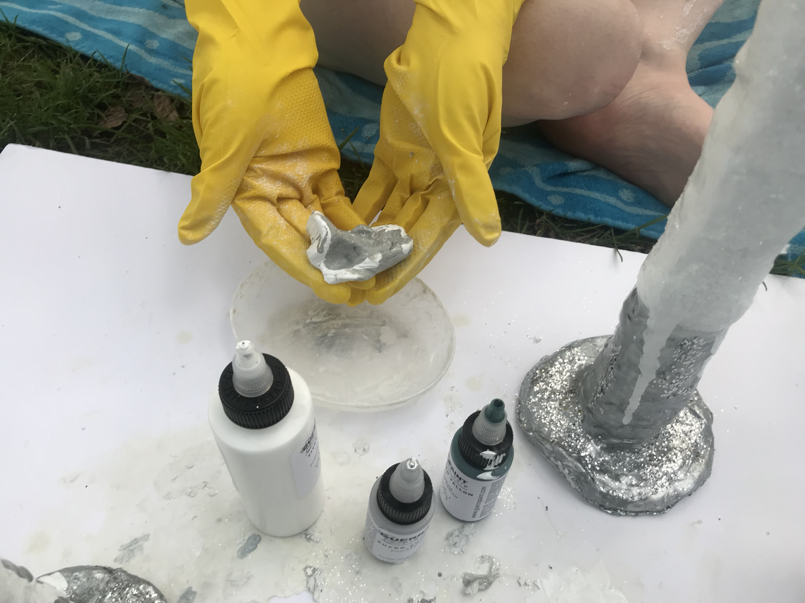
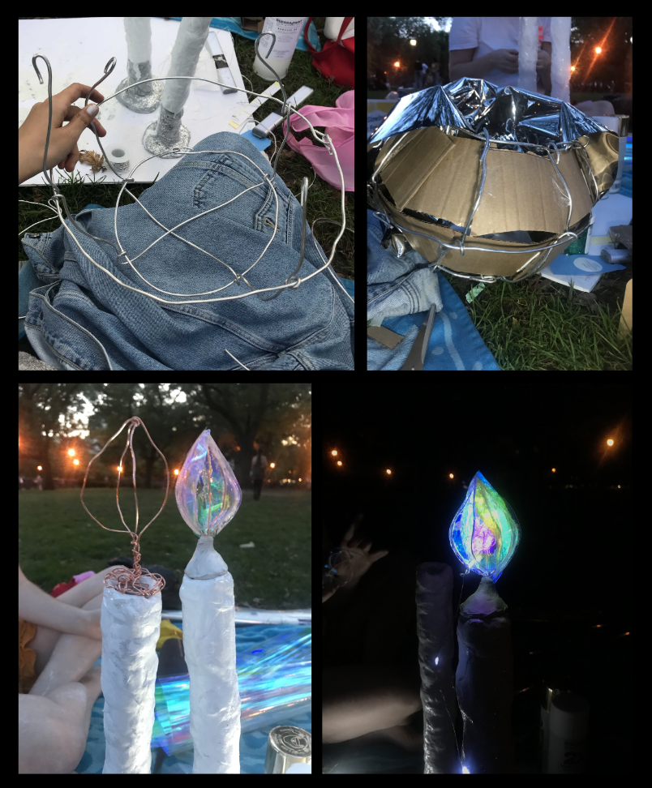
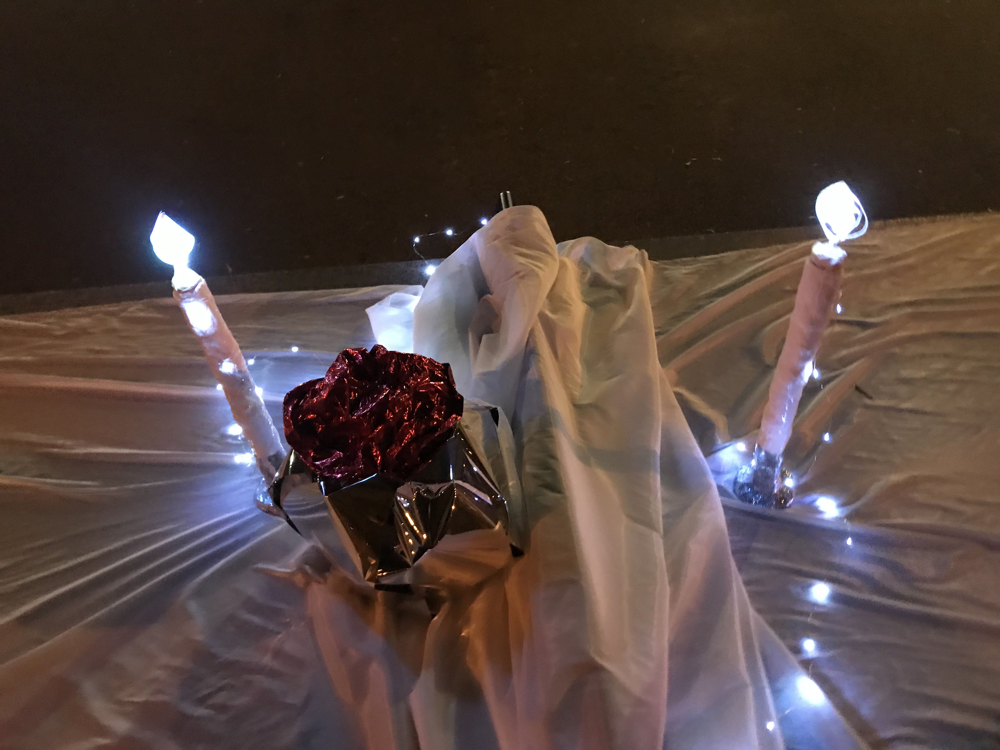
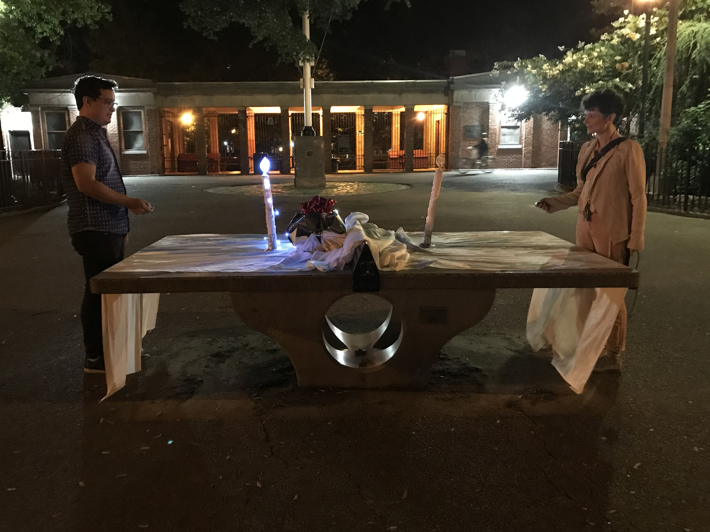
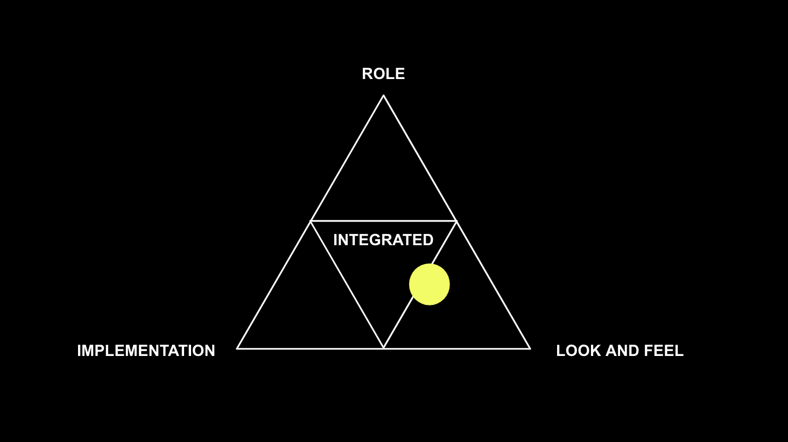
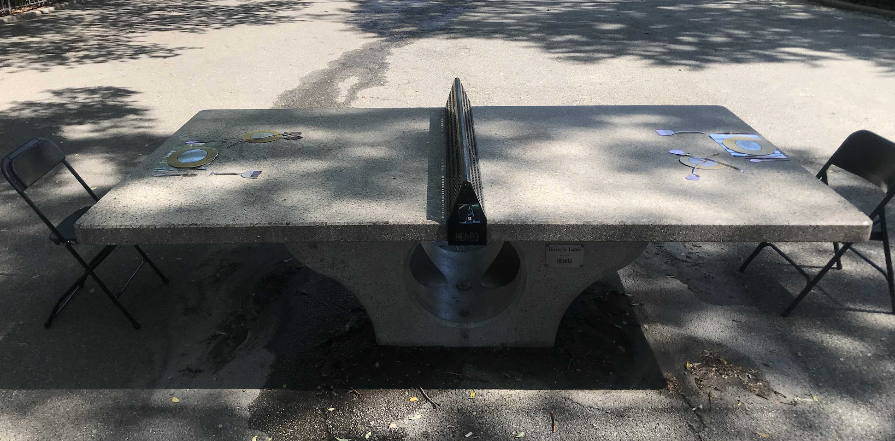
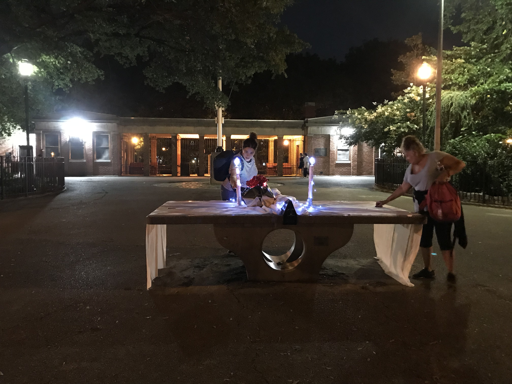

[<Back](README.md)

## 09/10/19 - Prototype II
#### Making Process
According to the in-class feedback from prototype I, we added a light-up experience to create unexpected surprise of lighting the other person’s candle (on the opposite side of the table). We also made large 3D tablewares to invite users to stop and investigate by looking and touching.

#### On-site testing

Click this [link](https://drive.google.com/open?id=1Nz5iqj0qb5GbPiJ6AudZ57LmWn1qfuNE) to view our documentation video.

#### Primary reactions/feelings we are targeting: 

-Emotional

-Playful

-Explorative/Investigative

-Reflective

The interactive installation evokes emotions through the design of surrealistic scene encountered as an interactive experience. The formal dinner date setting is meant to evoke sentimentality, romance, and highlights communication and the relationship between two people. The musical experience carried by jazz is meant to evoke the romantic feelings of a date and sentimental emotions connected to the jazz history of the location (Charlie Parker’s home across the street.) 

We want the experience to be led by curiosity and exploration. The interactive, light-up experience and the unexpected surprise of lighting the other person’s candle (on the opposite side of the table) is meant to deliver a whimsical, altered-reality experience through curious discovery. Including large, oversized objects invites users to stop and investigate by looking and touching.

#### How do we initiate interaction with the user?
We left one of the candles lit, and turned the other candle off, so that users would be attracted to the lights and see that there was the possibility of turning them on or off. This also offered the affordance and opportunity to discover how to light or turn off the candles. 

A hidden speaker inside of the vase playing jazz drew strangers to the table to investigate and stop to explore the scene. 

The lights and white tablecloth and chair coverings made the overall appearance of the scene eye-catching and highly noticeable to strangers from very far away (as we were told by users.)

#### What role does the form play in initiating the desired interactions?
-The original “game-play” function lingers as a subtle influence. 

-Chairs offer the affordance of sitting at a dinner table. (new)

-Remote controls give the affordance to pick up and press buttons.. 

-The music beckons strangers to stop and explore the table. 

-The reflective surface magnifies the lights. (new)

-The jumbo scale candles coated in glitter are highly visible and reflective.

-Leaving one candle lit sparks curiosity.

#### What did we change to make the interactions longer?
After one couple rearranged the objects on the table to create a divider out of the mirrored placemats, we left them that way. The candles were reflected when the mirrors were placed vertically behind them, giving the seated viewer a more surreal and strange field of vision. We left the mirrors set up that way for other users to experience.

#### Feedback
We received lots of notes on the beauty of the installation and that it was romantic or “cool.”

“It’s daring.” One man left and then came back 15 minutes later to tell us that he thought this.

“Is this supposed to make me feel high? I feel like I’m 45 minutes into tripping right now.” This is successful to us because we are striving to create a surreal, altered reality.

“It is beautiful and creative.” This was said by the park employees who were surveying the area, they thought it was particularly meaningful that it paid tribute to Charlie Parker who lived by the park, by using jazz.

“This reminds me of something that would be very meaningful to two people who met here in this park, and their romantic story.”

“This makes me think of the isolation people experience because of their obsession with devices and using their cellphones.”
We actually found this feedback gave us a fresh new perspective to our statement by changing the setting for the reflective surface. It was really helpful and we iterated our concept based on that comment.

#### Concept iteration
Strangers are given the opportunity to reflect on the unusual scene featuring a formal dining table set for a romantic date in an unexpected setting. The larger-than-life objects and dreamy aesthetic invite the user into a surreal, dream-like situation. The reflective surfaces act as dividers in the center of the table, reflecting each individual’s side of the table and their own candle. 

This is a commentary on people’s preoccupation with playing with tech-devices and not being present in the company of others. Despite dining together at a table, each user is preoccupied with their remote control device and the isolation of their own reflection. 

#### Meanings of the experience
We hope that user’s will continue to think about the experience and carry their reflections with them when they dine with others, or communicate/interact with other people. 

We want people to see their preoccupation with technology from a different perspective, and reflect on how staring into their cell phone or device cuts them off from the experience of being present with another person.  The idea of being at a romantic table for two, where they are isolated by the reflection of their own side of the table while they interact with someone on the other side. In this way, we are making a statement with the installation and interaction which we hope will stay with the user beyond this experience. 

One of our users said “I wish this kind of thing was everywhere!” as she left the installation.  We hope that users will look at the “real” world and everyday situations through a different lense after this experience. Maybe they will look at things with more curiosity and see more possibilities for surreal, unexpected experiences in everyday life. 

We also want users to reflect on the idea that there is no “end-goal”, that they are not “playing to win”  anything. 
Many of our prototype testers approached the installation with a competitive, game-play perspective and the idea that they had something to “win” by being “competing” with the person or (seen as the “other player”) on the opposite side of the table. The statement we are making is that there is nothing to win or lose, just art and the experience of being present. 
