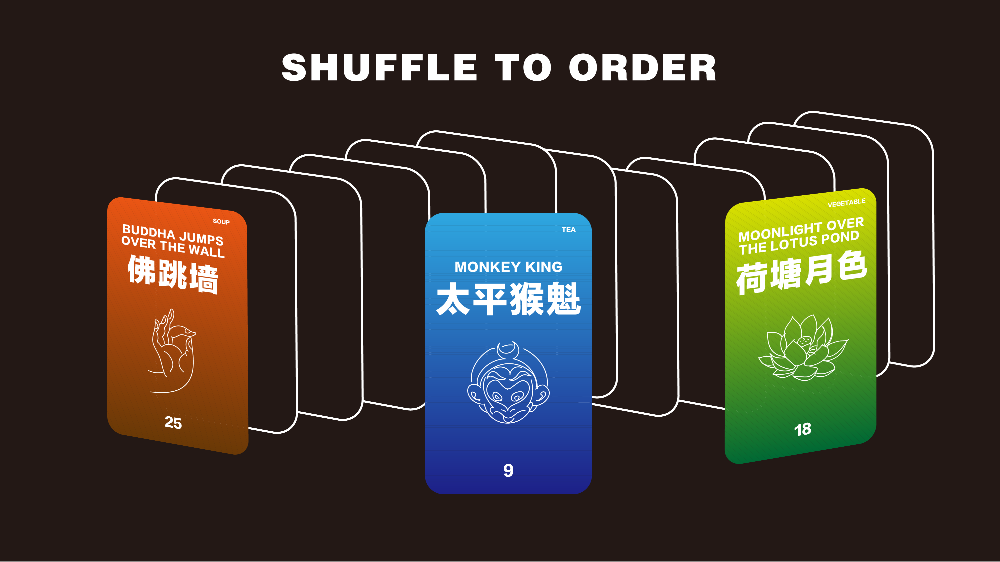
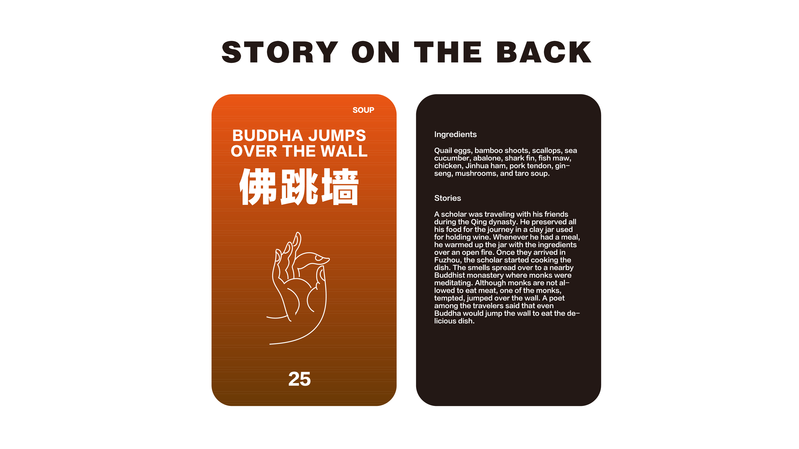
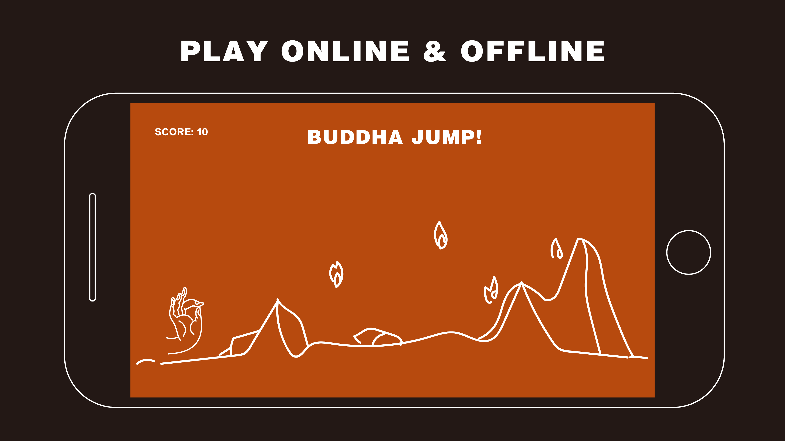
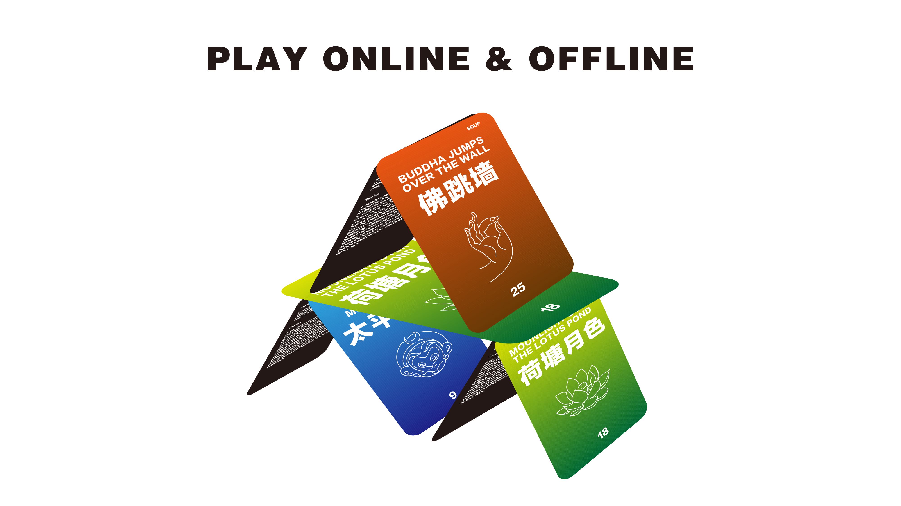
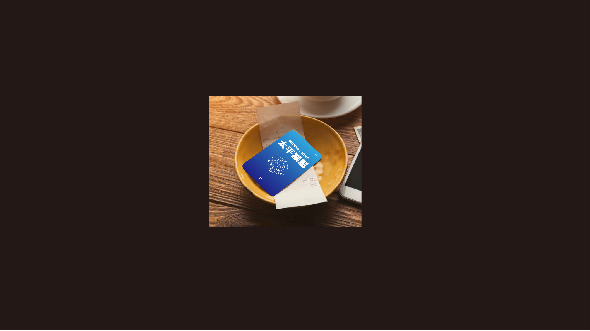

[<Back](README.md)

## 10/24/19 - Prototype 3: Card menu
Ordering in an restaurant for oneself could be hard. Same old boring routine, or too embarrassed to ask what to choose. Prototype 3 is to make ordering fun and playful.

Solo diners are actually more explorative in ordering. One of the reasons to stop us from trying new things could be the confusing naming from an unfamiliar culture. For example, there are a lot of Chinese dishes whose names sound hillarious or absurd if translated to English directly. But in fact the names are very poetic, descriptive or funny in Chinese because most of them have unique background stories. It's a shame to throw away all these valuable cultural origins and translate them only by ingredients. Based on that, I designed a menu(for Chinese dishes) made of cards to demonstrate playfulness. Each card is a signature dish. There are English name, Chinese name, illustration of Chinese meaning, category and price on the front side, and ingredients and stories on the back side. Instead of a regular menu, customers get a stack of cards to order. When you want to try something random, simply shuffle the cards like how you play in real card games. In the mobile version of the card menu, there could be a mini game designed after the name of a signature dish, like Buddha Jump! corresponding to the dish Buddha Jump over the Wall. The cards and the app together build a playful system for solo diners, function as both a descriptive food menu and a time killer to add fun for your time alone.

