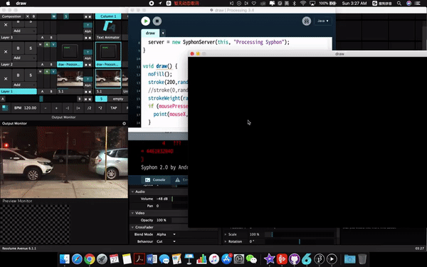

[<Back](README.md)

## 10/26/19 - Prototype 5: Window doodle

[Click here to watch the video](https://drive.google.com/file/d/14eYu1Ru4ANPJgdKA3tOfPE37SvI90YUx/view?usp=sharing)

In my previous observation at Ramen Takumi, single eaters are put at bar seats by the windows. During the whole time there, I either stared at the blank, or encountered a gaze from passerbys outside. It was a busy street, so there were many people walking by constantly. But single eaters were still quietly isolated from both inside and outside, and sometimes even felt awkward being watched. What if I create a game experience by the window, using the passerbys as NPC and background, to give solo diners a chance to take advantage of the window seats, and play with the lonliness?

I took a short film at the window seat from my perspective facing outside. I wrote a paint brush function in Processing and sent the signal to Avenue via Syphon to add visual effect on the video. Using Wacom tablet, I doodled on the video in realtime and tried to let the drawing interact with the passerbys in the video. Although this prototype is a simulation, it could still be achieved by AR in real life.

