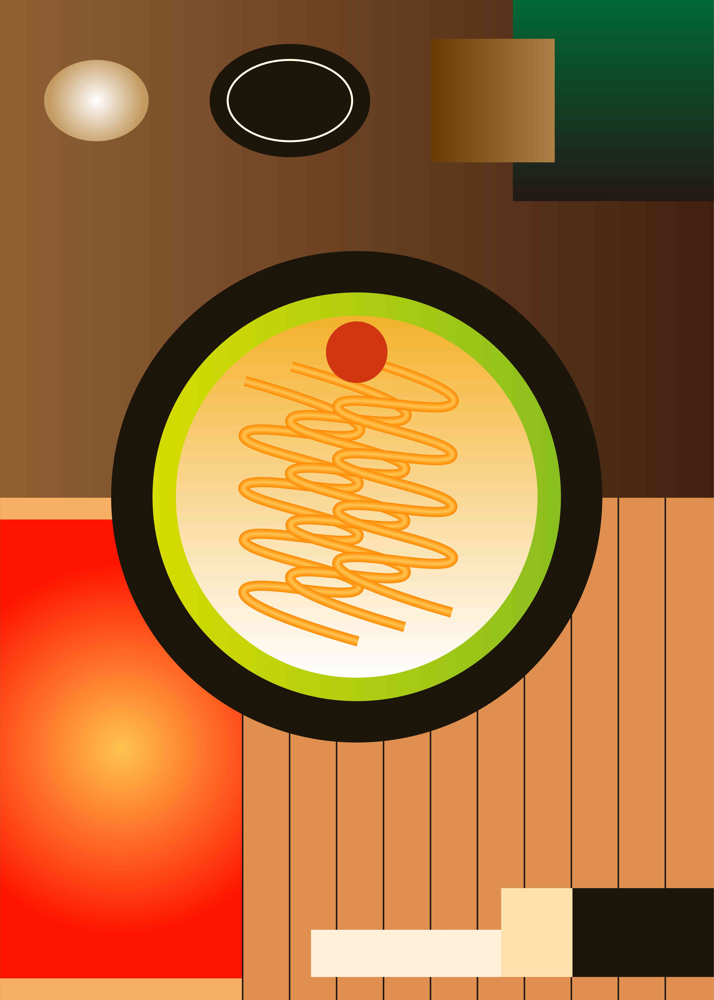
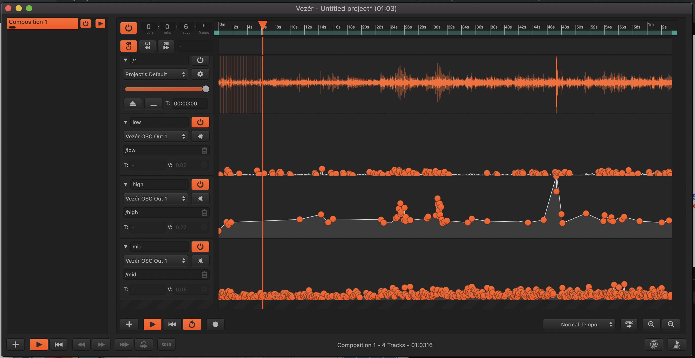
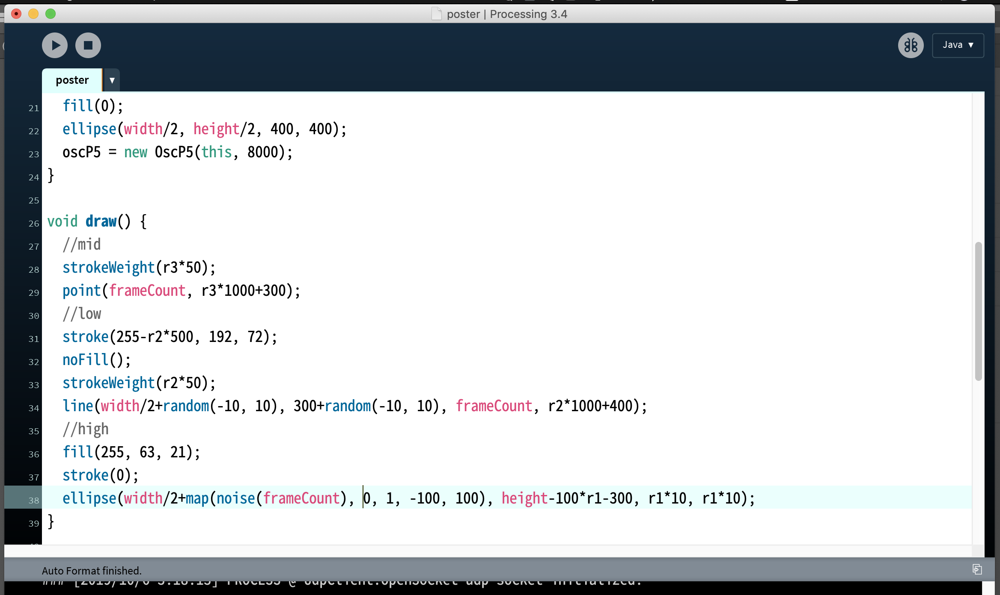
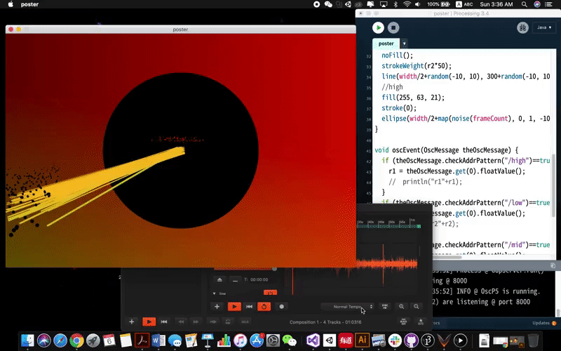
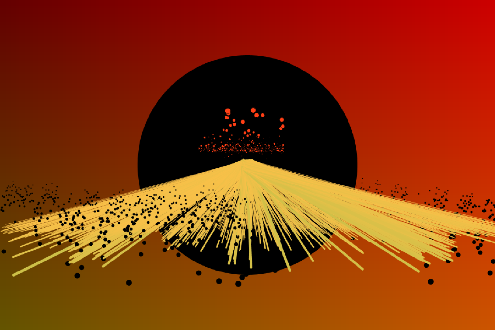
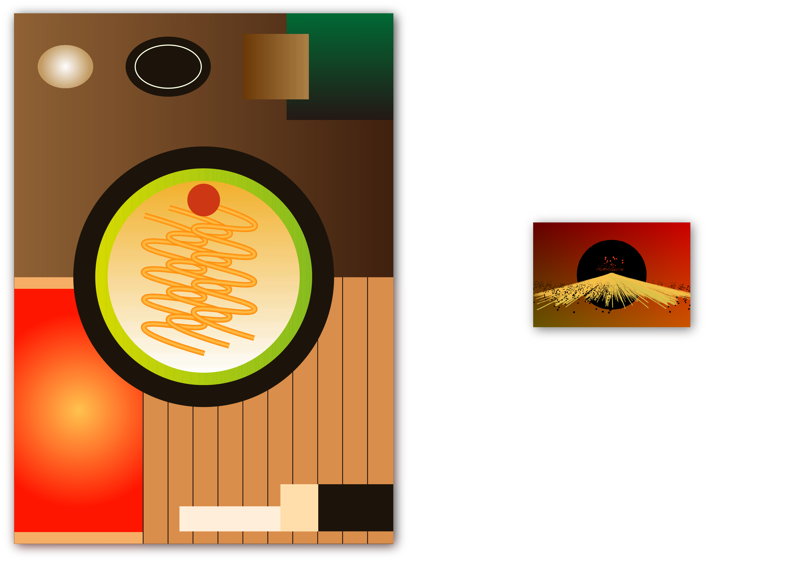

[<Back](README.md)

## 10/05/19 - Data Visualization
### Question: How to create a better dining experience for single eater?
#### Poster
Based on the observation last week, I found the warm color in Ichiran improved the solo dinning experience. In order to visualize that, I made a poster sized illustration to abstract the color of everything in the booth. Obejects are simplized and geometrized, only the colors and color ratios remained. 

#### Poster card
As menteioned in the last blog, I thought the sound in the dinning area contributed to the delightful atmosphere. To experiment the effect of the sounds, I made an audio visualization with the audio recordings.

First, I trimmed the file into 1 minute and used Vezer to separate the low, medium and high frequency of the audio.

I translated the sound wave into values and sent separate frequency groups of values to Processing via OSC.

Those values were used as variables to draw lines and dots. While the audio file was playing, the Processing sketch was drawn in real-time.

I kept the warm color and gave it a typical eastern aesthetics. The black circle, red dots and yellow-ish lines could be referred to ramen bowl, hot sauce and ramen noodle accordingly. Together they depicted a beautiful scenery which reminded the audience of mountain, sunset and snow.

Overall look of poster and postcard:

