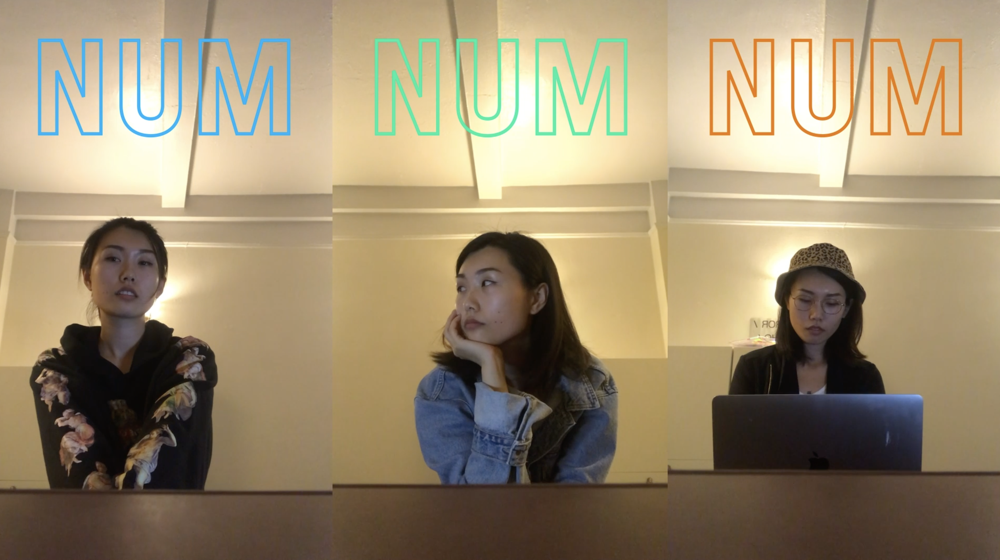
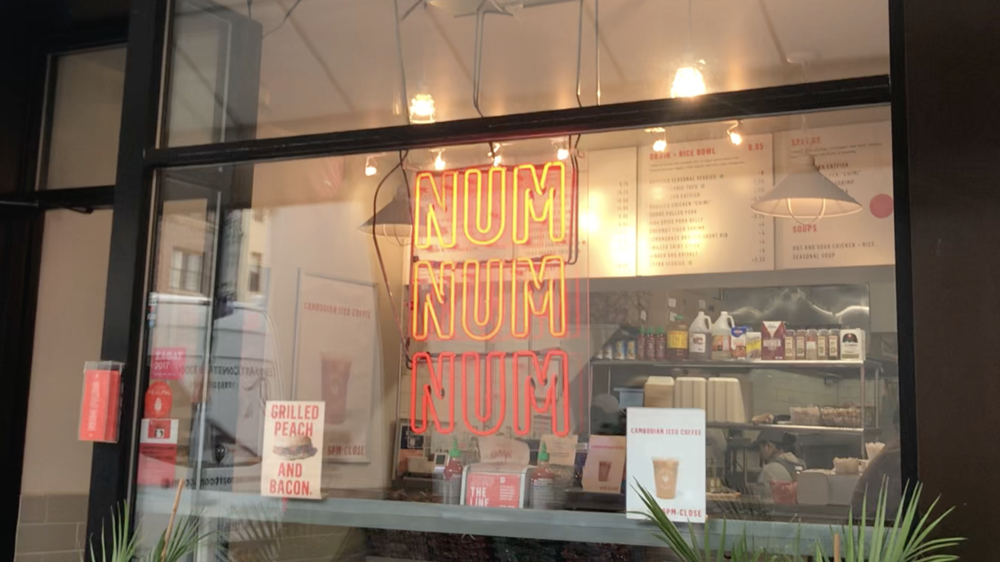

[<Back](README.md)

## 10/28/19 - Prototype 7: Sitting down, lighting up

[Click here to watch the video](https://drive.google.com/file/d/1zrKziMhbvR36_qfR26DjFlzlKSotwNR8/view?usp=sharing)

To continue exploring with the scenario in prototype 5, I started to think that instead of keeping the diners busy, there could be an interaction between the space and the diner, and also between different diners. In that way, the solo diners would feel more engaged and welcomed in the environment, and probably some unexpected sweet interactions could be generated between people, under the unconscious mood change.

There is this cute Cambodian sandwich store, Num Pang, where I often go for a quick bite. It's a tiny space with only few bar seats by the window, but the interior and exterior are well organized and pretty cozy and cute. I like especially how they put orange neon lights NUMNUMNUM at store front as an attraction.

From outside, you can see three NUMs aligned vertically and three seats by the window. What if the NUMs are put horizontally and right above each seat, to be used as an interactive object for each diner? Based on the ideas above, I made a simple approach to make a color changing interaction corresponing to the action of a person sitting down at each seat. When the person sits down, the weight sensor on the chair sense the weight and pass the signal to change the color of the neon light above. When more than one person are seated, the lights start to change in patterns, or switch colors between two people. The light changing could draw people's attention, and the "exchange" could be a trigger of a conversation.
