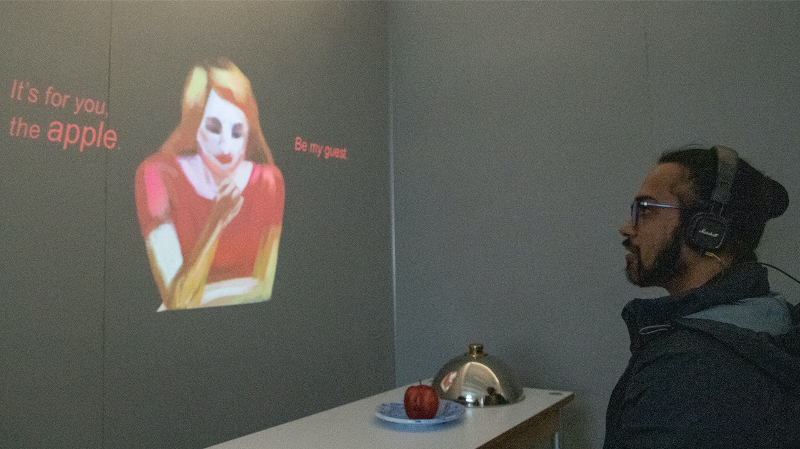

[<Back](README.md)

## 12/15/19 - Final output and reflection
In a small and quiet room, the participant is going to have a unique experience by interacting, listening, watching and eating alone in the room. The participant is expected to catch a feeling of comfort, and to build empathic understanding of loneliness in an emotional and sensual way.
This project aims to amplify the value of being alone, and make a statement that the honesty to face the loneliness could give us the power to eliminate the fear and ease the burden, and to discover the beauty of it. 

[Click to watch the video](https://drive.google.com/file/d/1TpxqsUNN6bfDdH4eK0ZAiXF9C-tzkTky/view?usp=sharing)

### a. What are the specific questions you are attempting to answer in your prototypes?
1.What's the positive sides of loneliness?

2.How to visualize that?

3.How to get people emotionally involved in a short period of time?

4.How to incorporate eating within an experience about loneliness?

### b. What the five strengths of your project?
1.An experinece in multi-dimensions;

2.Emotionally engaging;

3.Thought-provoking and reflective;

4.Relatable;

5.Beautiful story.

### c. What are the five most critical issues for your project?
1.The impact of loneliness;

2.How should we deal with negative feelings?

3.Mental health issues;

4.Single-living lifestyle;

5.Positive way of thinking.

### d. What can you do to address these issues, and to solidify the strengths?
1.Dig deeper into psychology and philosophy;

2.Read more about case studies of how to deal with loneliness and mental issues;

3.Observe, research and study about urban lifestyles;

4.Study about people who choose loneliness as a lifestyle.

### e. What new questions do you have?
How many levels of loneliness are there? To what extent we can heal ourselves and when do we really need to seek for medical assistance?

### f. What questions need to be answered in order to create a proof of concept prototype?
1.What do the audience feel after this experience?

2.What does it remind them of?

3.Can they follow the story and understand the concept?

4.Will the visuals, sounds and interactions work together to amplify the impact of this experience? 

5.Will the experience give the impact to help them in their future lives?

### g. How has this prototype allowed you to engage in your goals within this program? Does this feel like a possible future direction?
This topic is linked to a broader question in psychology, philosophy and mental health. In my understanding, loneliness has many levels. There is loneliness caused mostly by unwanted isolation, which we experience all the time as we often live independently nowadays(my project this semester is mostly at this level); there is more severe loneliness that causes mental health issues like depression and anxiety; there is also hermits who go self-banished into their rural retreats, that choose loneliness as a lifestyle, which is much to a philosophical level. By digging deeper into this topic, I could go further in psychological therapy study, (I actually have already started something onto art therapy but didn’t go on) or study about the philosophy of loneliness. I’m always fascinated by human emotions and the emotional factors that are affecting their choices of life. This is definitely a direction I'm interested in. I hope that by my artistic or design approaches, I could present the sophisticated human nature, and eventually bring hope to people. 
